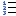

# Numbering command

## Summary

Inserts an ordered list.

## Description

Inserts an ordered list.

## How to Run

- Default Menu: **Edit** \> **Markdown** \> **Numbering**
- [All Commands](../tools/all_commands): **Edit** \> **Markdown** \> **Numbering**
- Toolbar: 
- Status Bar: None
- Default Keyboard Shortcut: None

## Plug-in Command ID

```
EEID_MARKDOWN_NUMBERING (23265)
```

## Macros

### \[JavaScript\]

```
editor.ExecuteCommandByID(23265);
```

### \[VBScript\]

```
editor.ExecuteCommandByID 23265
```
