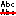

# Delete Duplicate Lines command

## Summary

Deletes duplicate lines in the selection or in the entire document.

## Description

Deletes duplicate lines in the selection or in the entire document. The first instance of the duplicate line will be retained.

## How to Run

- Default Menu: **Sort** \> **Delete Duplicate Lines**
- [All Commands](../tools/all_commands): **Sort** \> **Delete Duplicate Lines**
- Toolbar: 
- Status Bar: None
- Default Keyboard Shortcut: None

## Plug-in Command ID

```
EEID_DELETE_DUPLICATE (4564)
```

## Macros

### \[JavaScript\]

```
document.DeleteDuplicates("",0);
```

### \[VBScript\]

```
document.DeleteDuplicates "",0
```
