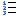

# Buttons on the Toolbar

## Buttons available on EmEditor Professional

|     |     |
| --- | --- |
| [New Text](../../cmd/file/file_new) | Create a new Text file. |
| [Open](../../cmd/file/file_open) | Open an existing file. |
| [Close and Open](../../cmd/file/file_close_open) | Close the file and open an existing file. |
| [Save](../../cmd/file/file_save) | Save the file. |
| [Save All](../../cmd/file/file_save_all) | Save all the files. |
| [Reload](../../cmd/file/file_reload) | Reload the file. |
| [Print](../../cmd/file/file_print) | Print the file. |
| [Print Preview](../../cmd/file/print_preview) | Displays preview of how this document will print. |
| [Exit](../../cmd/file/app_exit) | Quit EmEditor. |
| [Exit All](../../cmd/file/exit_all) | Save the file and exit. |
| [Cut](../../cmd/edit/edit_cut) | Cut the selection and put it on the Clipboard. |
| [Copy](../../cmd/edit/edit_copy) | Copy the selection and put it on the Clipboard. |
| [Paste](../../cmd/edit/edit_paste) | Insert Clipboard contents. |
| [Undo](../../cmd/edit/edit_undo) | Undo the last action. |
| [Redo](../../cmd/edit/edit_redo) | Redo the last undone action. |
| [Jump](../../cmd/edit/jump) | Jump to a specified line. |
| [Find](../../cmd/search/edit_find) | Find a string. |
| [Find Previous](../../cmd/search/edit_repeat_back) | Find previous occurrence. |
| [Find Next](../../cmd/search/edit_repeat) | Find next occurrence. |
| [Replace](../../cmd/search/edit_replace) | Replace a word. |
| [Erase Highlight](../../cmd/search/erase_find_hilite) | Erase highlight. |
| [Find in Files](../../cmd/search/grep) | Search for a string in multiple files. |
| [No Wrap](../../cmd/view/wrap_none) | Show lines without wrapping. |
| [Wrap by Characters](../../cmd/view/wrap_by_char) | Show lines wrapping by specified characters. |
| [Wrap by Window](../../cmd/view/wrap_by_window) | Show lines wrapping by window size. |
| [Wrap by Page](../../cmd/view/wrap_by_paper) | Wrap lines according to page width. |
| [Font](../../cmd/view/font) | Change font settings. |
| [Properties for Current Configuration](../../cmd/tools/customize) | Change properties for currently selected configuration. |
| [Properties for all Configurations](../../cmd/tools/all_prop) | Change properties for all configurations. |
| [Select Configuration (popup menu)](../../cmd/tools/config_popup) | Show a popup menu to select a configuration. |
| [Customize](../../cmd/tools/common_settings) | Customize the common application settings. |
| [Record or Finish Quick Macro](../../cmd/macros/quick_macro_record) | Record or Finish Quick Macro. |
| [Run Quick Macro](../../cmd/macros/quick_macro_run) | Run Quick Macro. |
| [Always on Top](../../cmd/window/window_always_top) | Toggle to show this window always on top. |
| [Toggle Bookmark](../../cmd/bookmarks/bookmark_toggle) | Toggle bookmark on the current line. |
| [Previous Bookmark](../../cmd/bookmarks/bookmark_prev) | Go to the previous bookmark. |
| [Next Bookmark](../../cmd/bookmarks/bookmark_next) | Go to the next bookmark. |
| [Clear bookmarks](../../cmd/bookmarks/bookmark_clear) | Clear all bookmarks. |
| [Save and Close](../../cmd/file/file_save_exit) | Save and Close the current file. |
| [Save and Close All](../../cmd/file/save_exit_all) | Save and Close all open files. |
| [Find Matching Parenthesis/Bracket](../../cmd/edit/next_paren) | Moves the cursor to the corresponding parenthesis/bracket. |
| [Duplicate Line](../../cmd/insert/duplicate_line) | Duplicates the current logical line. |
| [Insert Special Character](../../cmd/insert/insert_control) | Insert special character. |
| [Marks](../../cmd/view/view_marks) | Toggle newline characters, EOF and tab marks. |
| [Comment](../../cmd/convert/edit_comment) | Comment out the selection. |
| [Uncomment](../../cmd/convert/edit_uncomment) | Removes comment marks in the selection. |
| [Increase Line Indent](../../cmd/convert/indent) | Increase line indent in the selection. |
| [Decrease Line Indent](../../cmd/convert/unindent) | Decrease line indent in the selection. |
| [Save Macro](../../cmd/macros/macro_save) | Save the temporary macro. |
| [Edit Macro](../../cmd/macros/macro_edit) | Edit the selected macro. |
| [Select Macro](../../cmd/macros/macro_select) | Select a macro. |
| [Toggle Horizontal Split](../../cmd/window/window_split_horz_toggle) | Toggle the horizontal window split. |
| [Combine Windows](../../cmd/window/window_combine) | Combine multiple windows. |
| [Increase Font Size](../../cmd/view/increase_font_size) | Increase the display font size. |
| [Decrease Font Size](../../cmd/view/decrease_font_size) | Decrease the display font size. |
| [Replace in Files](../../cmd/search/replace_in_files) | Replace text in multiple files. |
| [Previous Bookmark in This Window](../../cmd/bookmarks/bookmark_prev_within) | Go to the previous bookmark in this window. |
| [Next Bookmark in This Window](../../cmd/bookmarks/bookmark_next_within) | Go to the next bookmark in this window. |
| [Delete](../../cmd/edit/delete) | Deletes the selection, or deletes one character at the right of the cursor. |
| [Full Screen](../../cmd/view/full_screen) | Toggles the full screen mode. |
| [Sticky Vertical Mode](../../cmd/edit/vertical_mode) | Toggles the sticky vertical mode. |
| [Collapse All](../../cmd/edit/outline_collapse_all) | Collapses the entire document while the outlining is displayed. |
| [Expand All](../../cmd/edit/outline_expand_all) | Expands the entire document while the outlining is displayed. |
| [Save As](../../cmd/file/file_save_as) | Saves the current file with a new name. |
| [Cycle Clipboard Ring](../../cmd/edit/paste_history) | Inserts one of the contents from the Clipboard history at the cursor position. |
| [Normal Mode](../../cmd/csv/mode_normal) | Clears the CSV (Comma-separated), TSV (Tab-separated), and DSV (User-defined Delimiter-separated) modes. |
| [CSV Mode](../../cmd/csv/mode_csv) | Selects the CSV (Comma-separated) mode. |
| [TSV Mode](../../cmd/csv/mode_tsv) | Selects the TSV (Tab-separated) mode. |
| [DSV Mode](../../cmd/csv/mode_dsv) | Selects the user-defined DSV (Delimiter-separated) mode. |
| [Toggle Narrowing](../../cmd/edit/narrowing_toggle) | Sets or resets only the selection as editable area and make the rest inaccessible. |
| [Sort A to Z](../../cmd/sort/sort_text_a) | Sort text at the current column in ascending order. |
| [Sort Z to A](../../cmd/sort/sort_text_d) | Sort text at the current column in descending order. |
| [Sort Smallest to Largest](../../cmd/sort/sort_num_a) | Sort numbers at the current column in ascending order. |
| [Sort Largest to Smallest](../../cmd/sort/sort_num_d) | Sort numbers at the current column in descending order. |
| [Compare](../../cmd/diff/compare_direct) | Compares two recently viewed documents without specifying options. |
| [Rescan](../../cmd/diff/compare_rescan) | Rescans the compared documents and refresh the results. |
| [Synchronize Scrolling](../../cmd/diff/sync_scroll_direct) | Synchronizes scrolling of two recently viewed documents without specifying options. |
| [Reset](../../cmd/diff/compare_reset) | Resets comparison or synchronized scrolling mode and clears comparison results. |
| [Line Numbers](../../cmd/view/view_line_numbers) | Shows or hides line numbers. |
| [Ruler](../../cmd/view/view_ruler) | Shows or hides the ruler. |
| [Outlining](../../cmd/view/outline_bar_guide) | Shows or hides outlining. |
| [Auto Indent](../../cmd/view/toggle_auto_indent) | Enables or disables the auto indent. |
| [Insert Spaces for Tabs](../../cmd/view/toggle_spaces_tab) | Inserts spaces for tabs. |
| [Wrap Indent](../../cmd/view/toggle_wrap_indent) | Enables or disables the wrap indent. |
| [Tab Columns](../../cmd/view/tab_column_popup) | Displays a popup menu to select tab columns. |
| [Indent Columns](../../cmd/view/indent_column_popup) | Displays a popup menu to select indent columns. |
| [HTML/XML Character Reference to Unicode](../../cmd/convert/decode_html_char_ref) | Decodes the selected text from HTML/XML Character Reference. |
| [Unicode to HTML/XML Character Reference](../../cmd/convert/encode_html_char_ref) | Encodes the selected text to HTML/XML Character Reference. |
| [Universal Character Names to Unicode](../../cmd/convert/decode_ucn) | Decodes the selected text from Universal Character Names. |
| [Unicode to Universal Character Names](../../cmd/convert/encode_ucn) | Encodes the selected text to Universal Character Names. |
| [Check Spelling](../../cmd/edit/spell_toggle) | Checks spelling of the document. |
| [Find Toolbar](../../cmd/view/show_find_bar) | Shows or hides the find toolbar. |
| [Back](../../cmd/edit/caret_back) | Moves the cursor to the previous position. |
| [Forward](../../cmd/edit/caret_forward) | Moves the cursor to the next position. |
| [CSV Converter](../../cmd/csv/csv_converter) | Shows or hides the CSV Converter. |
| [Columns/Separators](../../cmd/csv/sv_sep_popup) | Shows a popup menu to work with columns or separators. |
| [Heading](../../cmd/csv/heading_popup) | Shows a popup menu to set headings. |
| [Delete Duplicate Lines](../../cmd/sort/delete_duplicate) | Deletes duplicate lines in the selection or in the entire document. |
| [Sort by Multiple Columns](../../cmd/sort/sort_multi) | Sorts the document by multiple columns. |
| [Filter Toolbar](../../cmd/view/show_filter_bar) | Shows or hides the filter toolbar. |
| [Sort Shortest to Longest](../../cmd/sort/sort_length_a) | Sorts text at the current column by length in ascending order. |
| [Sort Longest to Shortest](../../cmd/sort/sort_length_d) | Sorts text at the current column by length in descending order. |
| [Delete Duplicate Lines (Advanced)](../../cmd/sort/delete_duplicate_advanced) | Displays a dialog box to specify settings and deletes duplicate lines in the selection or in the entire document. |
| [Join CSV](../../cmd/csv/join_csv) | Joins two CSV documents. |
| [Extract Columns](../../cmd/csv/extract_columns) | Extracts specified columns from the current CSV document. |
| [CommitList](../plugin/plugin_commit_list) | CommitList Plug-in. |
| [Explorer](../plugin/plugin_explorer) | Explorer Plug-in. |
| [HTMLBar](../plugin/plugin_htmlbar) | HTMLBar Plug-in. |
| [Open Documents](../plugin/plugin_opendocuments) | Open Documents Plug-in. |
| [Projects](../plugin/plugin_projects) | Projects Plug-in. |
| [Search](../plugin/plugin_search) | Search Plug-in. |
| [Snippets](../plugin/plugin_snippets) | Snippets Plug-in. |
| [Web Preview](../plugin/plugin_webpreview) | Web Preview Plug-in. |
| [Word Complete](../plugin/plugin_wordcomplete) | Word Complete Plug-in. |
| [Word Count](../plugin/plugin_wordcount) | Word Count Plug-in. |
| [Bold](../../cmd/edit/markdown_bold) | Toggles a bold style. |
| [Italic](../../cmd/edit/markdown_italic) | Toggles an italic style. |
| [Code](../../cmd/edit/markdown_code) | Toggles a code style. |
| [Clear All Formatting](../../cmd/edit/markdown_clear) | Removes bold and italic formatting from the selected text. |
| [Hyperlink](../../cmd/edit/markdown_hyperlink) | Inserts a hyperlink. |
| [Remove Hyperlinks](../../cmd/edit/markdown_remove_hyperlinks) | Removes hyperlinks. |
| [Image](../../cmd/edit/markdown_image) | Inserts an Image. |
| [Table](../../cmd/edit/markdown_table) | Inserts a table. |
| [Horizontal Rule](../../cmd/edit/markdown_hr) | Inserts a horizontal rule. |
| [Line Break](../../cmd/edit/markdown_line_break) | Inserts a line break. |
| [Numbering](../../cmd/edit/markdown_numbering) | Inserts an ordered list. |
| [Bullets](../../cmd/edit/markdown_bullets) | Inserts an unordered list. |
| [Markdown Design View](../../cmd/edit/markdown_view) | Displays the Markdown design view. |
| [Markdown Preview](../../cmd/edit/markdown_preview) | Displays the Markdown preview of the current document. |
