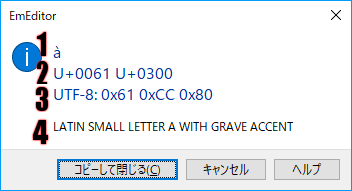

# \[文字コード値\] ダイアログ ボックス

\[文字コード値\] ダイアログ ボックスは、カーソル位置の現在の文字シーケンスに関する様々な情報を表示します。このダイアログ ボックスは、 [\[文字コード値\] コマンド](../../cmd/view/watch_char_code) を選択すると表示されます。

\[文字コード値\] ダイアログ ボックスは、次の情報を表示します。

1行目: 文字

2行目: Unicode コード値

3行目: 文書のエンコード、およびエンコードされた文字の値

4行目: この文字の Unicode 名

表示された情報は、\[コピーして閉じる\] ボタンを選択することにより、コピーできます。
