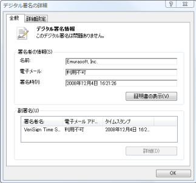

# Q. 新しいバージョンの EmEditor をインストールするにはどうしたらいいでしょうか?

EmEditor ホーム ページから EmEditor 最新版をダウンロードしてインストールします。次の手順で行ってください。

1\. トレイ アイコンが実行されている場合は、トレイ アイコンを終了します。これを行うには、タスクバー上に表示されているトレイ アイコンを右クリックし、表示されるメニューで \[トレイ アイコンを閉じる\] コマンドを選択します。

2\. コントロール パネルから、以前のバージョンの EmEditor を選択してアンインストールします。

3\. アンインストールの最中、「アンインストール時に EmEditor の設定を保持しますか?」というメッセージが表示されることがあります。以前の設定を保持したい場合は「はい」を選択します。以前の設定を保持する必要がない場合は「いいえ」を選択することを推奨します。

4\. 次のサイトから選択してダウンロードしたいリンクをクリックします。

5\. ダウンロードするリンクをクリックすると、以下のような \[ファイルのダウンロード - セキュリティの警告\] ダイアログ ボックスが表示されます。

6\. \[実行\] ボタンをクリックすると、ダウンロードが開始し、ダウンロードが完了後、以下のような \[Internet Explorer - セキュリティの警告\] ダイアログ ボックスが表示されます。

7\. ここで、「発行元: Emurasoft, Inc.」の部分をクリックします。

8\. \[デジタル署名の詳細\] ダイアログが表示されます。ここで、「このデジタル署名は問題ありません」と表示されていることを必ず確認します。もし表示されない場合は、ダウンロードされたファイルが壊れている可能性があり、このまま継続しても正しくインストールされません。この場合は、一度、ブラウザの一時ファイルをクリアしてから、再度ダウンロードすることをおすすめします。\[OK\] をクリックしてこのダイアログ ボックスを閉じます。

9\. \[実行する\] ボタンをクリックし、画面の指示にしたがってセットアップを進めて行きます。
