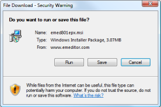

# 질문. 엠에디터의 새로운 버전을 설치하려면 어떻게 해야 하나요?

엠에디터 홈 페이지에서 최신 버전의 엠에디터를 설치할 수 있습니다.
다음의 과정을 따라해 주십시오:

1\. 트레이 아이콘이 실행되고 있다면 닫으십시오. 트레이 아이콘을 닫기 위해서 작업 표시 줄에 있는 트레이 아이콘에서 오른쪽 클릭을
한 후, **트레이 아이콘 닫기** 를 선택하십시오.

2\. 제어판에서 이전 버전의 엠에디터를 제거하십시오.

3\. 이전 설정을 유지하려면, "완전히 제거하기 전에 엠에디터 설정을 유지하시겠습니까?" 라는 메시지 상자가
나타날 때, "네"를 선택하십시오.
모든 이전 설정을 유지하지 않고 싶다면 "No" 를 선택하기를 권장합니다.

4\. 다음의 링크중에 원하는 하나를 선택해서 엠에디터의 유형과 운영 체제의 버전을 선택하십시오:

 (트라이얼 버전)

 (풀 버전, 이메일 주소와 패스워드로 로그인 하신 후, **가능한 다운로드** 를 클릭하십시오.)

5\. 다운로드를 위한 링크를 클릭할 때, **파일 다운로드 \- 보안 경고** 대화 상자가 나타납니다:

6\. **실행하기** 버튼을 클릭하게 되면 다운로드를 시작해야 하며, **인터넷 익스플로러 \- 보안 경고** 대화 상자가 나타납니다:

7\. **발행인: Emurasoft, Inc.** 을 클릭하십시오.

8\. **디지털 서명의 자세한 사항** 대화에서 **이 디지털 서명은 OK 입니다** 를 읽었는지 반드시 확인하십시오.
만일 이 구가 대화상자에서 나타나지 않을 경우, 다운로드 파일은 손상을 입게 되며,
임시 인터넷 파일을 지워야 하고, 다운로드를 다시 해 주십시오.
대화 상자를 닫기 위해 확인을 클릭하십시오.

9\. **실행** 버튼을 클릭해서 설치를 시작하게 됩니다. 설치를 계속하기 위해서 스크린상에 나타난 지시를 따라 주십시오.
