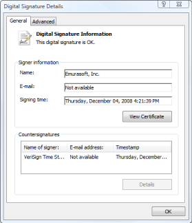

# Q. 你能告诉我怎么安装最新版本的 EmEditor 吗？

您可以在 EmEditor 网页上下载最新版本的编辑器。步骤如下:

1\. 如果托盘图标还在运行，请关闭它。要要关闭托盘图标，您可以在任务栏上右击托盘图标，然后选择“关闭托盘图标”。

2\. 从控制面板中先卸载前一版本的 EmEditor。

3\. 信息框会出现提示信息: “在完全卸载 EmEditor 前，您想要 EmEditor 的设置保持不变吗？”如果您想要保留原来的设定，请选择“是”。我们推荐您选择“否”，除非您非常需要保留原来的设定以继续完成你的工作。

4\. 选择要下载的 EmEditor 版本和配置。您可以用下面的链接来下载:

5\. 当您点击下载链接后，会出现一个文件下载-安全警告 对话框:

6\. 请点击“运行”，然后会弹出一个网络浏览器-安全警告 对话框:

7\. 选择发布商: Emurasoft, Inc.

8\. 请确保在电子签名细节 对话框中有“电子签名可用” 这个信息。如果这个信息没有在对话框中显示，那么下载的文件可能被损坏了。这样您就需要先清除临时的网络文件 (Temporary Internet files)，再尝试下载一次。点击“确定”关闭对话框。

9\. 请点击“运行” 键来开始安装程序。你只需照着屏幕上出现的指令一步一步做就可以完成安装了。
