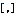

# 使用數字範圍 (篩選工具列) 命令

### 摘要

> 切換篩選工具列上的「使用數字範圍」按鈕。

### 說明

> 切換篩選工具列上的「使用數字範圍」按鈕。

### 運行方法

- 預設功能表: 無
- [全部命令](../tools/all_commands): **搜索**
\> **篩選工具列** \> **使用數字範圍**
- 工具列:   (篩選工具列)
- 狀態列: 無
- 預設捷徑: 無

### 外掛程式命令ID

- EEID\_FILTERBAR\_NUMBER\_RANGE (4013)

### 巨集

#### \[JavaScript\]

> editor.ExecuteCommandByID(4013);

#### \[VBScript\]

> editor.ExecuteCommandByID 4013