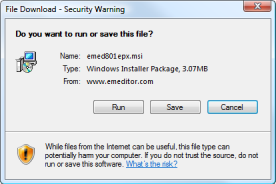

# Q. 您能告訴我怎么安裝最新版本的 EmEditor 嗎？

您可以在 EmEditor 網頁上下載最新版本的編輯器。步驟如下:

1\. 如果系統匣圖示還在運行，請關閉它。要要關閉系統匣圖示，您可以在任務欄上右擊系統匣圖示，然后選擇 **「關閉系統匣圖示」**。

2\. 從控制面板中先卸載前一版本的EmEditor。

3\. 信息框會出現提示信息: 「在完全卸載 EmEditor 前，您想要 EmEditor 的設置保持不變嗎？」如果您想要保留原來的設定，請選擇「是」。我們推薦您選擇「否」，除非您非常需要保留原來的設定以繼續完成您的工作。

4\. 選擇要下載的 EmEditor 版本和配置。您可以用下面的連結來下載:

5\. 當您點擊下載連結后，會出現一個 **檔案下載-安全警告** 對話方塊:

6\. 請點擊 **「運行」**，然后會彈出一個 **網絡瀏覽器-安全警告** 對話方塊:

7\. 選擇 **發布商: Emurasoft, Inc.**

8\. 請確保在 **電子簽名細節** 對話方塊中有 **「電子簽名可用」** 這個信息。如果這個信息沒有在對話方塊中顯示，那么下載的檔案可能被損壞了。這樣您就需要先清除臨時的網絡檔案(Temporary Internet files)，再嘗試下載一次。點擊「確定」關閉對話方塊。

9\. 請點擊 **「運行」** 鍵來開始安裝程序。您只需照著屏幕上出現的指令一步一步做就可以完成安裝了。
